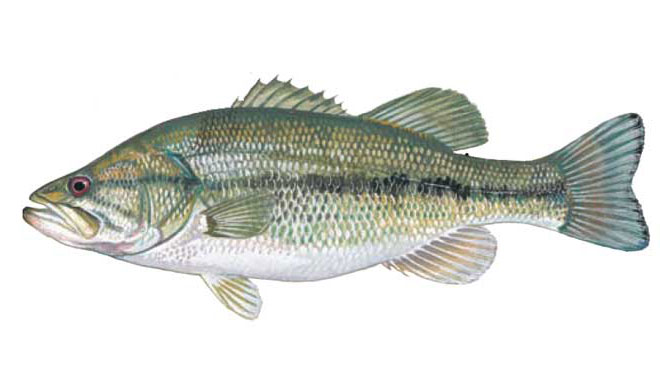
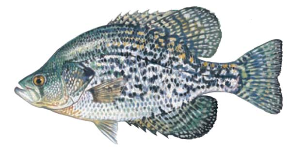
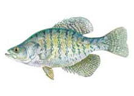
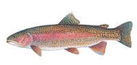
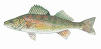

# Freshwater Fish
Fishing in freshwater environments opens up opportunities to target a wide variety of species, 
each requiring different techniques, rigs, and lures.  
This page provides an overview of the most popular freshwater gamefish in North America, 
grouped by family, with images for easy identification.  

---

##__Black Bass__

-   <figure markdown>
        { loading=lazy width="200" }
        <figcaption>Largemouth Bass</figcaption>
    </figure>
-   <figure markdown>
        { loading=lazy width="200" }
        <figcaption>Smallmouth Bass</figcaption>
    </figure>
-   <figure markdown>
        { loading=lazy width="200" }
        <figcaption>Spotted (Alabama) Bass</figcaption>
    </figure>

---

##__Temperate Bass__

-   <figure markdown>
        { loading=lazy width="200" }
        <figcaption>Hybrid Bass</figcaption>
    </figure>
-   <figure markdown>
        { loading=lazy width="200" }
        <figcaption>Striped Bass</figcaption>
    </figure>
-   <figure markdown>
        { loading=lazy width="200" }
        <figcaption>White Bass</figcaption>
    </figure>
-   <figure markdown>
        { loading=lazy width="200" }
        <figcaption>White Perch</figcaption>
    </figure>

---

##__Sunfish__

-   <figure markdown>
        { loading=lazy width="200" }
        <figcaption>Black Crappie</figcaption>
    </figure>
-   <figure markdown>
        { loading=lazy width="200" }
        <figcaption>White Crappie</figcaption>
    </figure>
-   <figure markdown>
        { loading=lazy width="200" }
        <figcaption>Bluegill</figcaption>
    </figure>
-   <figure markdown>
        { loading=lazy width="200" }
        <figcaption>Green Sunfish</figcaption>
    </figure>
-   <figure markdown>
        { loading=lazy width="200" }
        <figcaption>Pumpkinseed</figcaption>
    </figure>
-   <figure markdown>
        { loading=lazy width="200" }
        <figcaption>Redbreast Sunfish</figcaption>
    </figure>
-   <figure markdown>
        { loading=lazy width="200" }
        <figcaption>Redear Sunfish (Shellcracker)</figcaption>
    </figure>
-   <figure markdown>
        { loading=lazy width="200" }
        <figcaption>Warmouth</figcaption>
    </figure>

---

##__Pickerel__

-   <figure markdown>
        { loading=lazy width="200" }
        <figcaption>Chain Pickerel</figcaption>
    </figure>
-   <figure markdown>
        { loading=lazy width="200" }
        <figcaption>Redfin Pickerel</figcaption>
    </figure>

---

##__Coldwater Trout__

-   <figure markdown>
        { loading=lazy width="200" }
        <figcaption>Brook Trout</figcaption>
    </figure>
-   <figure markdown>
        { loading=lazy width="200" }
        <figcaption>Brown Trout</figcaption>
    </figure>
-   <figure markdown>
        { loading=lazy width="200" }
        <figcaption>Rainbow Trout</figcaption>
    </figure>

---

##__Catfish__

-   <figure markdown>
        { loading=lazy width="200" }
        <figcaption>Blue Catfish</figcaption>
    </figure>
-   <figure markdown>
        { loading=lazy width="200" }
        <figcaption>Channel Catfish</figcaption>
    </figure>
-   <figure markdown>
        { loading=lazy width="200" }
        <figcaption>Flathead Catfish</figcaption>
    </figure>
-   <figure markdown>
        { loading=lazy width="200" }
        <figcaption>Yellow Bullhead</figcaption>
    </figure>

---

##__Perch__

-   <figure markdown>
        { loading=lazy width="200" }
        <figcaption>Walleye</figcaption>
    </figure>
-   <figure markdown>
        { loading=lazy width="200" }
        <figcaption>Yellow Perch</figcaption>
    </figure>

---

##__Other Species__

-   <figure markdown>
        { loading=lazy width="200" }
        <figcaption>Common Carp</figcaption>
    </figure>
-   <figure markdown>
        { loading=lazy width="200" }
        <figcaption>Grass Carp</figcaption>
    </figure>
-   <figure markdown>
        { loading=lazy width="200" }
        <figcaption>Longnose Gar</figcaption>
    </figure>

