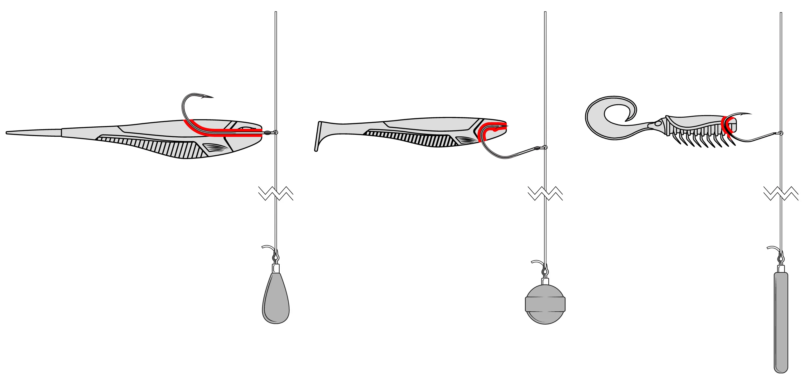
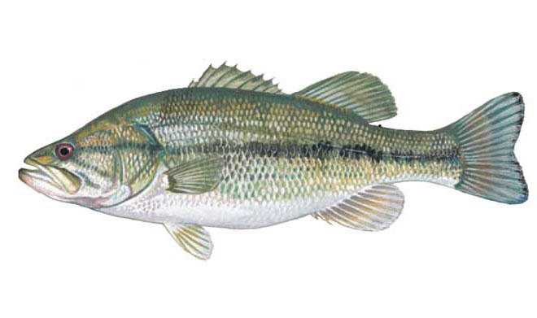
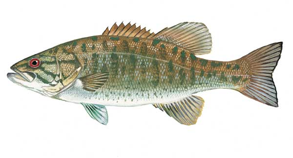
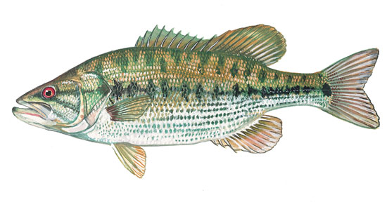
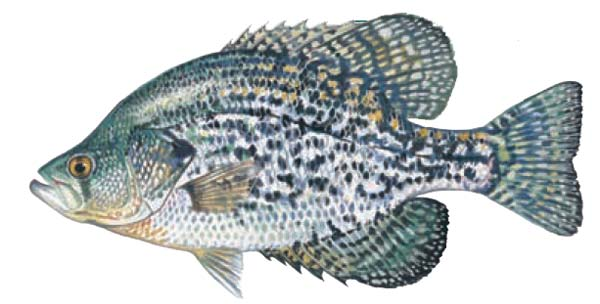
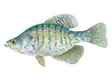
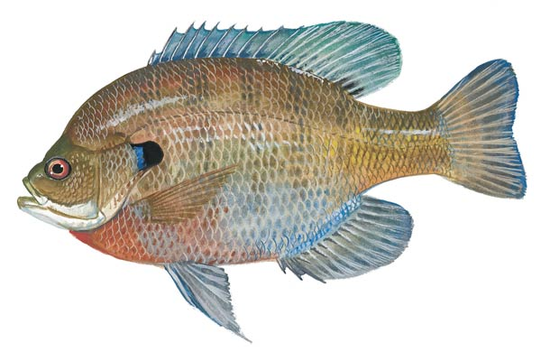
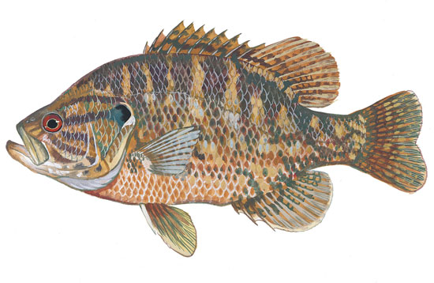
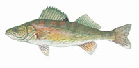

# Drop Shot - Beginner

## Introduction

{ loading=lazy }
/// caption
Image Source: [Rapala - Rapala](https://www.google.com/url?sa=i&url=https%3A%2F%2Fwww.rapala.ca%2Fca_en%2Fblog%2Fdrop-shot-tips-for-smallmouth-and-walleye%3Fsrsltid%3DAfmBOoobWwHAWraGBF0LaqN0J10sBYRkhWLtUNMqfot8NlB-MKqgZeH9&psig=AOvVaw2sDouPSFiVEBId_Pwp6oK4&ust=1755887370220000&source=images&cd=vfe&opi=89978449&ved=0CBYQjRxqFwoTCIiztKzEnI8DFQAAAAAdAAAAABAE)
///

Drop Shot is a versatile finesse fishing technique where the weight is tied at the end of the line, and the hook is positioned above it. This setup keeps the bait suspended off the bottom, making it effective for targeting bass and other freshwater species.

## Target Fish

-   <figure markdown>
        { loading=lazy width="200" }
        <figcaption>Largemouth Bass</figcaption>
    </figure>
-   <figure markdown>
        { loading=lazy width="200" }
        <figcaption>Smallmouth Bass</figcaption>
    </figure>
-   <figure markdown>
        { loading=lazy width="200" }
        <figcaption>Spotted (Alabama) Bass</figcaption>
    </figure>
-   <figure markdown>
        { loading=lazy width="200" }
        <figcaption>Black Crappie</figcaption>
    </figure>
-   <figure markdown>
        { loading=lazy width="200" }
        <figcaption>White Crappie</figcaption>
    </figure>
-   <figure markdown>
        { loading=lazy width="200" }
        <figcaption>Bluegill</figcaption>
    </figure>
-   <figure markdown>
        { loading=lazy width="200" }
        <figcaption>Warmouth</figcaption>
    </figure>
-   <figure markdown>
        { loading=lazy width="200" }
        <figcaption>Walleye</figcaption>
    </figure>

## Rigging

 
Click :fontawesome-brands-youtube:{ .youtube } [here](https://www.youtube.com/watch?v=RMht6raod60) 
to learn how to rig a drop shot.

## Rod & Reel & Line & Hook
- **Rod** – 6'6" to 7'2" spinning rod  
    - **Power**: Light or Medium-Light  
    - **Action**: Fast or Extra-Fast
- **Reel** – 2000-3000 size Spinning reel
    - **Gear Ratio**: 5.2:1 - 6.2:1
- **Line** – 6-12 lb fluorocarbon or 6-10 lb braided line with fluorocarbon leader; low visibility  
- **Hook** – 1/0 to 3/0 drop shot hook or octopus hook (not the circle octopus hook)

## Best Conditions
- **Season** – Spring and Fall are ideal; fish are more active and feed aggressively
- **Air Temperature** – 50°F to 75°F (10°C to 24°C)
- **Water Temperature** – 55°F to 70°F (13°C to 21°C)
- **Water Depth** – 6 to 20 ft (2 to 6 meters), near structure or drop-offs
- **Water Visibility** – Clear to slightly stained water is best; in murky water use brighter colored baits
- **Water Type** – Freshwater lakes, reservoirs, and slow rivers
- **Weather** – Overcast or slightly cloudy days improve bite; avoid extreme wind
- **Light Conditions** – Morning and late afternoon tend to be most productive
- **Grass Condition** – Moderate vegetation is ideal; fish often hover at the edges of grass beds

## Recommended Lure

- **Roboworm Straight Tail Worms**
    - 4.5" Aarons Magic or Aarons Morning Dawn
    - 6" Aarons Magic or Aarons Morning Dawn

## How to Fish

If you wish to learn through video, please watch following video in order:

1. :fontawesome-brands-youtube:{ .youtube } [Drop Shot Intro](https://www.youtube.com/watch?v=gKhBOSKKncg)
2. :fontawesome-brands-youtube:{ .youtube } [Drop Shot Advanced 1](https://www.youtube.com/watch?v=0RKM5SKW9fQ)
3. :fontawesome-brands-youtube:{ .youtube } [Drop Shot Advanced 2](https://www.youtube.com/watch?v=BDU1rchMCAU)

**Or**, if you prefer reading:

When using a drop shot, less movement often works better. Don’t shake or twitch your lure too much. Hold the rod loosely. If you haven’t had a bite for a while, try “deadsticking”: leave the drop shot still, then reel in a few feet and stop again. Usually, you want to move the drop shot lightly on a slack line while keeping the weight on the bottom—unless you are targeting fish you see suspended on your fishfinder.

In colder months, it’s even more important to slow down. Many anglers add a scent or color to the bait’s belly or tail to attract fish while using slow or dead stick action. Don’t just use a worm—try other soft plastics like swimbaits, minnows, or small creature baits to get more bites.

For craw-style baits, use a shorter leader to keep the bait near the bottom for a natural look. For swimbaits, you can drag the drop shot along the bottom to make the tail move more and attract fish.

## Tips & Tricks